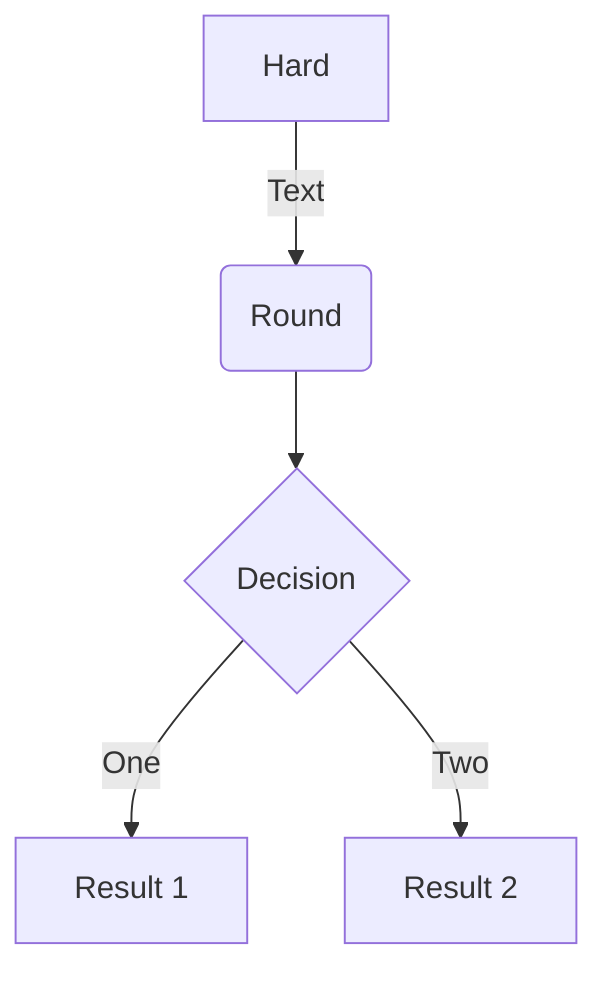
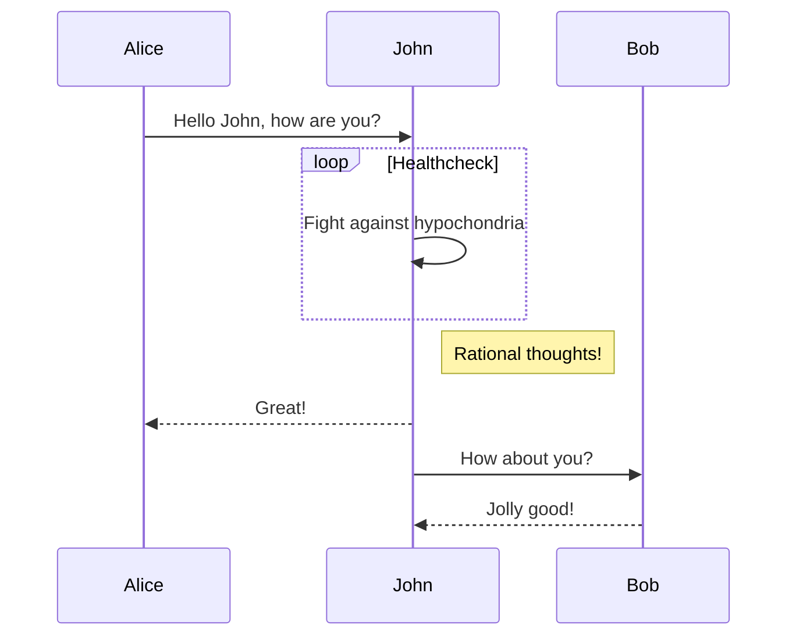
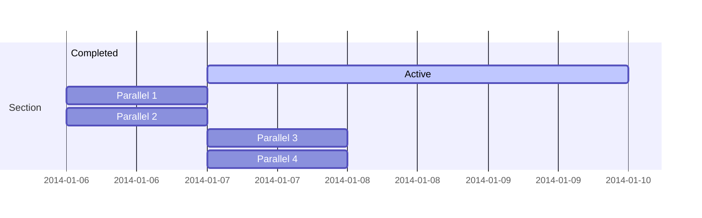
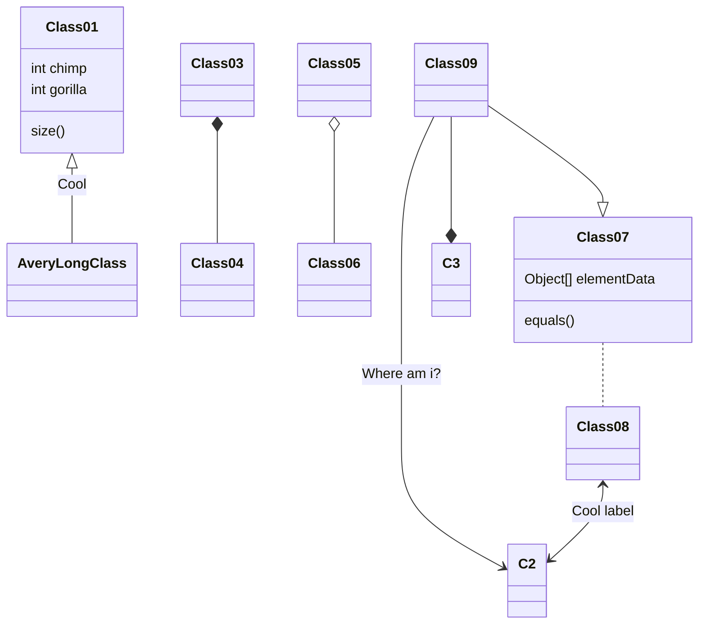
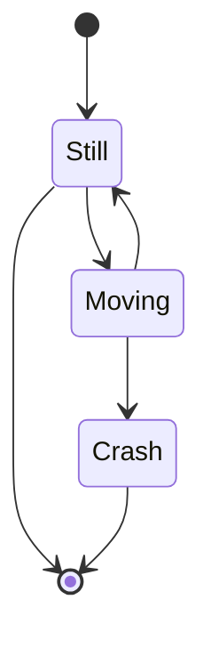

Markdown, или маркдаун, — это язык разметки для текстовых документов. Он позволяет создавать тексты без использования Word и других редакторов. Разметку можно прочитать и воспроизвести в любой системе или браузере.

Маркдаун создал писатель и блогер Джон Грубер вместе с веб-активистом Аароном Шварцем. Они хотели придумать максимально простой и удобный язык разметки, с помощью которого текст можно перевести в красиво оформленный вид. При этом текст обязан оставаться читаемым даже без приведения к «красивому» виду. Таким и оказался Markdown. Его создали в 2004 году, но наибольшую популярность язык получил сейчас. Его поддерживают разнообразные платформы для блогов, сервисы создания заметок, CMS и даже мессенджеры. Поэтому маркдаун полезно знать всем, кто имеет дело с вебом, от разработчиков до блогеров.
Как пользоваться языком разметки

Человек пишет текст в любом редакторе и добавляет в него специальные комбинации стандартных символов. Это разметка, она показывает, где текст должен быть жирным, где — заголовком, а в каком месте нужен список. С помощью символов можно разметить заголовки, выделения текста и даже сложные конструкции вроде таблиц. Специальные преобразователи формируют на основе разметки готовый документ. Это похоже на использование HTML, но маркдаун проще, текст в нем более читаемый. Преобразователи или изначально есть в текстовом редакторе, например в приложении для заметок, или скачиваются отдельно.


### Кто пользуется маркдауном

    Пользователи интернета, которые общаются в мессенджерах и пишут заметки в сервисах, поддерживающих разметку.
    Разработчики, которые пишут с помощью маркдауна документацию для проектов, — им нужен простой и надежный инструмент.
    Контент-менеджеры при наполнении сайтов, которые поддерживают маркдаун. Разметка может использоваться и на веб-страницах.
    Блогеры, пишущие лонгриды, когда оформляют материалы для статей. Многие платформы для написания текстов поддерживают маркдаун, например Notion.
    Писатели и копирайтеры, которым нужен простой инструмент для оформления текста — разметка, читаемая с любого устройства.
    Энтузиасты, которые пользуются разметкой в личных целях: пишут заметки и списки дел, ведут дневники или составляют карточки для запоминания.

### Для чего нужен маркдаун

    Быстрое форматирование статьи для перевода в PDF или чтобы она просто выглядела красиво без лишних усилий.
    Верстка текстового документа для размещения на сайте, но без применения HTML.
    Написание документации для кода.
    Составление заметок в личном цифровом блокноте.
    Написание красивых сообщений в мессенджерах.

### Правила разметки 

Основной синтаксис. Он очень простой: текст «оборачивается» в символы или они ставятся перед строкой. Вот так, например, будут выглядеть заголовки.

· # Заголовок H1 (первого уровня, например название текста)

· ## Заголовок H2 (второго уровня, заголовки)

· ### Заголовок H3 (третьего уровня, промежуточные подзаголовки)

И так далее, вплоть до заголовков шестого уровня с шестью решетками перед строкой. На практике подзаголовки ниже H3 практически не используют.

В маркдауне можно применить базовое форматирование текста. Буквицу или рукописный шрифт вставить не получится, но выделить важные участки — легко.

· *Курсив* или _курсив_

· **Жирный текст** или __жирный текст__

· ***Жирный и подчеркнутый текст***

· > Цитата (угловая скобка ставится перед каждой строкой цитаты)

· — Пункт маркированного списка

· 1. Первый пункт нумерованного списка

· 2. Второй пункт нумерованного списка (и так далее)

Вставка материалов. Разметка позволяет вставлять в текст разные элементы: ссылки и изображения, которые потом «подтянутся» в документ, когда применится форматирование.

· [текст_ссылки](любая ссылка) для вставки ссылок

· [подпись к картинке](ссылка на картинку) для вставки картинок в текст

· ***, — или ___ — горизонтальная линия на всю строку, которая отделяет часть текста от другой

А если в тексте должна быть звездочка или любой другой «специальный» символ, который можно прочесть не так, перед ней надо поставить обратный слэш. Например, вот так: *. Тогда символ отобразится в тексте как надо и не считается как правило разметки.

Расширенный синтаксис. Существует расширенная версия маркдауна. Она называется GFM, GitHub Flavored Markdown. В ней есть другие интересные возможности, например, ~~зачеркнутый текст~~, обернутый в две тильды, или `короткий кусок кода`. Многострочный блок кода оборачивается в три грависа над верхней и под нижней строкой. Вот так:

«`

Здесь будет строка кода.

И здесь тоже.

«`

Можно создавать таблицы, построенные на символах вертикальной и горизонтальной черты. Или «списки дел»:

— [X] Выполненное дело

— [ ] Невыполненное дело

Если редактор поддерживает GFM, то все подобные элементы синтаксиса тоже преобразуются и будут выглядеть как на веб-странице. В нем есть даже эмодзи: нужно просто вставить в текст код нужного смайла, обернутый в двоеточия. Примерно так: :smile:. Коды эмодзи есть в открытом доступе, их можно посмотреть в интернете.

### Как начать работать с маркдауном

Все очень просто: нужно установить или открыть любой редактор, который поддерживает эту разметку, и начать писать. Есть локальные редакторы, их надо скачивать, а есть те, что работают в браузере через интернет, как веб-сервис. Выбирайте любой, настраивайте под свои нужды и начинайте. Синтаксис простой, его легко выучить. Может быть даже так, что вы уже частично им пользуетесь: например, в мессенджере Telegram для форматирования текста используется именно маркдаун.

Если вы хотите пользоваться маркдауном не для личных заметок, а для оформления текста в блоге или на сайте, нужно подключить к ним плагин с поддержкой Markdown. Это тоже несложно, такие плагины существуют для многих CMS.

Маркдаун пригодится и тем, кто планирует карьеру разработчика. Он нужен в контенте, в веб-программировании, в написании документации. На профессиональных курсах мы подробно рассказываем об этом и других инструментах для разных целей.

## Более полная информация на английском с примерами

*просто очень хороший пост*


Wowchemy is designed to give technical content creators a seamless experience. You can focus on the content and Wowchemy handles the rest.

**Highlight your code snippets, take notes on math classes, and draw diagrams from textual representation.**

On this page, you'll find some examples of the types of technical content that can be rendered with Wowchemy.

## Examples

### Code

Wowchemy supports a Markdown extension for highlighting code syntax. You can customize the styles under the `syntax_highlighter` option in your `config/_default/params.yaml` file.

    ```python
    import pandas as pd
    data = pd.read_csv("data.csv")
    data.head()
    ```

renders as

```python
import pandas as pd
data = pd.read_csv("data.csv")
data.head()
```

### Mindmaps

Wowchemy supports a Markdown extension for mindmaps.

Simply insert a Markdown `markmap` code block and optionally set the height of the mindmap as shown in the example below.

A simple mindmap defined as a Markdown list:

<div class="highlight">
<pre class="chroma">
<code>
```markmap {height="200px"}
- Hugo Modules
  - wowchemy
  - wowchemy-plugins-netlify
  - wowchemy-plugins-netlify-cms
  - wowchemy-plugins-reveal
```
</code>
</pre>
</div>

renders as

```markmap {height="200px"}
- Hugo Modules
  - wowchemy
  - wowchemy-plugins-netlify
  - wowchemy-plugins-netlify-cms
  - wowchemy-plugins-reveal
```

A more advanced mindmap with formatting, code blocks, and math:

<div class="highlight">
<pre class="chroma">
<code>
```markmap
- Mindmaps
  - Links
    - [Wowchemy Docs](https://wowchemy.com/docs/)
    - [Discord Community](https://discord.gg/z8wNYzb)
    - [GitHub](https://github.com/wowchemy/wowchemy-hugo-themes)
  - Features
    - Markdown formatting
    - **inline** ~~text~~ *styles*
    - multiline
      text
    - `inline code`
    -
      ```js
      console.log('hello');
      console.log('code block');
      ```
    - Math: $x = {-b \pm \sqrt{b^2-4ac} \over 2a}$
```
</code>
</pre>
</div>

renders as

```markmap
- Mindmaps
  - Links
    - [Wowchemy Docs](https://wowchemy.com/docs/)
    - [Discord Community](https://discord.gg/z8wNYzb)
    - [GitHub](https://github.com/wowchemy/wowchemy-hugo-themes)
  - Features
    - Markdown formatting
    - **inline** ~~text~~ *styles*
    - multiline
      text
    - `inline code`
    -
      ```js
      console.log('hello');
      console.log('code block');
      ```
    - Math: $x = {-b \pm \sqrt{b^2-4ac} \over 2a}$
```

### Charts

Wowchemy supports the popular [Plotly](https://plot.ly/) format for interactive charts.

Save your Plotly JSON in your page folder, for example `line-chart.json`, and then add the `` shortcode where you would like the chart to appear.

Demo:



You might also find the [Plotly JSON Editor](http://plotly-json-editor.getforge.io/) useful.

### Math

Wowchemy supports a Markdown extension for $\LaTeX$ math. You can enable this feature by toggling the `math` option in your `config/_default/params.yaml` file.

To render _inline_ or _block_ math, wrap your LaTeX math with `$...$` or `$$...$$`, respectively. (We wrap the LaTeX math in the Wowchemy _math_ shortcode to prevent Hugo rendering our math as Markdown. The _math_ shortcode is new in v5.5-dev.)

Example **math block**:

```latex

$$
\gamma_{n} = \frac{ \left | \left (\mathbf x_{n} - \mathbf x_{n-1} \right )^T \left [\nabla F (\mathbf x_{n}) - \nabla F (\mathbf x_{n-1}) \right ] \right |}{\left \|\nabla F(\mathbf{x}_{n}) - \nabla F(\mathbf{x}_{n-1}) \right \|^2}
$$

```

renders as


$$\gamma_{n} = \frac{ \left | \left (\mathbf x_{n} - \mathbf x_{n-1} \right )^T \left [\nabla F (\mathbf x_{n}) - \nabla F (\mathbf x_{n-1}) \right ] \right |}{\left \|\nabla F(\mathbf{x}_{n}) - \nabla F(\mathbf{x}_{n-1}) \right \|^2}$$


Example **inline math** `$\nabla F(\mathbf{x}_{n})$` renders as $\nabla F(\mathbf{x}_{n})$.

Example **multi-line math** using the math linebreak (`\\`):

```latex

$$f(k;p_{0}^{*}) = \begin{cases}p_{0}^{*} & \text{if }k=1, \\
1-p_{0}^{*} & \text{if }k=0.\end{cases}$$

```

renders as



$$
f(k;p_{0}^{*}) = \begin{cases}p_{0}^{*} & \text{if }k=1, \\
1-p_{0}^{*} & \text{if }k=0.\end{cases}
$$



### Diagrams

Wowchemy supports a Markdown extension for diagrams. You can enable this feature by toggling the `diagram` option in your `config/_default/params.toml` file or by adding `diagram: true` to your page front matter.

An example **flowchart**:

    ```mermaid
    graph TD
    A[Hard] -->|Text| B(Round)
    B --> C{Decision}
    C -->|One| D[Result 1]
    C -->|Two| E[Result 2]
    ```

renders as



An example **sequence diagram**:

    ```mermaid
    sequenceDiagram
    Alice->>John: Hello John, how are you?
    loop Healthcheck
        John->>John: Fight against hypochondria
    end
    Note right of John: Rational thoughts!
    John-->>Alice: Great!
    John->>Bob: How about you?
    Bob-->>John: Jolly good!
    ```

renders as



An example **Gantt diagram**:

    ```mermaid
    gantt
    section Section
    Completed :done,    des1, 2014-01-06,2014-01-08
    Active        :active,  des2, 2014-01-07, 3d
    Parallel 1   :         des3, after des1, 1d
    Parallel 2   :         des4, after des1, 1d
    Parallel 3   :         des5, after des3, 1d
    Parallel 4   :         des6, after des4, 1d
    ```

renders as



An example **class diagram**:

    ```mermaid
    classDiagram
    Class01 <|-- AveryLongClass : Cool
    Class03 *-- Class04
    Class05 o-- Class06
    Class07 .. Class08
    Class09 --> C2 : Where am i?
    Class09 --* C3
    Class09 --|> Class07
    Class07 : equals()
    Class07 : Object[] elementData
    Class01 : size()
    Class01 : int chimp
    Class01 : int gorilla
    Class08 <--> C2: Cool label
    ```

renders as



An example **state diagram**:

    ```mermaid
    stateDiagram
    [*] --> Still
    Still --> [*]
    Still --> Moving
    Moving --> Still
    Moving --> Crash
    Crash --> [*]
    ```

renders as



### Todo lists

You can even write your todo lists in Markdown too:

```markdown
- [x] Write math example
  - [x] Write diagram example
- [ ] Do something else
```

renders as

- [x] Write math example
  - [x] Write diagram example
- [ ] Do something else

### Tables

Save your spreadsheet as a CSV file in your page's folder and then render it by adding the _Table_ shortcode to your page:

```go

```

renders as



### Callouts

Academic supports a [shortcode for callouts](https://wowchemy.com/docs/content/writing-markdown-latex/#callouts), also referred to as _asides_, _hints_, or _alerts_. By wrapping a paragraph in `{} ... {}`, it will render as an aside.

```markdown
{}
A Markdown aside is useful for displaying notices, hints, or definitions to your readers.
{}
```

renders as

{}
A Markdown aside is useful for displaying notices, hints, or definitions to your readers.
{}

### Spoilers

Add a spoiler to a page to reveal text, such as an answer to a question, after a button is clicked.

```markdown

You found me!

```

renders as

 You found me! 

### Icons

Academic enables you to use a wide range of [icons from _Font Awesome_ and _Academicons_](https://wowchemy.com/docs/getting-started/page-builder/#icons) in addition to [emojis](https://wowchemy.com/docs/content/writing-markdown-latex/#emojis).

Here are some examples using the `icon` shortcode to render icons:

```markdown
 Terminal  
 Python  
 R
```

renders as

 Terminal  
 Python  
 R

### Did you find this page helpful? Consider sharing it 🙌
